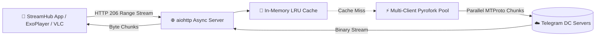

<div align="center">

# ⚡ OmniArchiver F2L
### 🚀 High-Performance Telegram File-to-Link & Video Streaming Gateway

<p align="center">
  <a href="https://www.python.org/"></a>
  <a href="https://github.com/Mayuri-Chan/pyrofork"></a>
  <a href="https://docs.aiohttp.org/"></a>
  <a href="https://www.docker.com/"></a>
  <a href="LICENSE"></a>
</p>

<p align="center">
  <b>A production-grade Telegram MTProto streaming proxy & auto-indexing gateway.</b><br>
  Built specifically for <b>Anime, Movie & Web Series channels</b>, powering <b>StreamHub</b>, ExoPlayer, VLC, and mpv.
</p>

---

[Key Features](#-key-features) | [Architecture](#-system-architecture) | [Deploy to Alwaysdata](#-deploy-on-alwaysdata-free--unlimited-bandwidth) | [Docker Setup](#-docker--docker-compose-deployment) | [API Reference](#-rest-api--streaming-endpoints) | [License](#-license)

---

</div>

## 🌟 Highlights & Key Features

<table>
  <tr>
    <td width="50%">
      <h3>📂 Multi-Channel Auto-Indexing</h3>
      Connects to your <b>Anime, Movie & Web Series channels</b> simultaneously. Runs <code>/index</code> to scan your channel history and auto-indexes new uploads in real-time.
    </td>
    <td width="50%">
      <h3>🔍 Instant Search & Batch Links</h3>
      Search any movie or anime (<code>/search 86</code> or type in PM). Groups anime/series into a clean <b>Batch Episode List</b> with a 1-click <b>📋 Copy All Batch Links</b> button!
    </td>
  </tr>
  <tr>
    <td width="50%">
      <h3>🚀 Multi-Client Worker Pooling</h3>
      Distributes MTProto chunk download streams across multiple auxiliary bot tokens (<code>MULTI_TOKENS</code>) to smash Telegram single-session bandwidth limits and achieve <b>20–30+ MB/s playback</b>.
    </td>
    <td width="50%">
      <h3>⏩ RFC 7233 Range Seeking</h3>
      Native <b>HTTP 206 Partial Content</b> handling allows instant scrub/seeking across timestamps without connection drops or buffer lag in ExoPlayer, VLC, and iOS/Android players.
    </td>
  </tr>
  <tr>
    <td width="50%">
      <h3>🧠 In-Memory LRU Ring Buffer</h3>
      Caches media container header chunks (first 5MB & last 2MB) directly in memory, reducing video probing and startup delays to <b>0 ms</b>.
    </td>
    <td width="50%">
      <h3>💾 Ultra-Low RAM Footprint</h3>
      Direct generator chunk piping operates at <b>~60 MB – 90 MB RAM</b>, running flawlessly inside low-memory servers (like Alwaysdata's 256MB free tier).
    </td>
  </tr>
</table>

---

## 🏛️ System Architecture



---

## 📂 Project Tree

```
OmniArchiver-F2L/
├── bot/
│   ├── core/
│   │   ├── config.py           # Validated environment loader & URL generator
│   │   ├── client_pool.py      # Multi-session MTProto connection balancer
│   │   ├── database.py         # Async SQLite (omni_archiver.db) & MongoDB repository
│   │   ├── cache.py            # In-memory LRU ring buffer for 0ms header probing
│   │   └── file_properties.py  # Media metadata & MIME resolver
│   ├── server/
│   │   ├── routes.py           # HTTP endpoints (/stream, /dl, /watch, /api/v1/search)
│   │   ├── stream_handler.py   # RFC 7233 Range request & MTProto chunk streamer
│   │   ├── web_server.py       # aiohttp app factory with universal CORS
│   │   └── templates/          # Modern Plyr.js dark web player & status dashboard
│   ├── plugins/
│   │   ├── start.py            # /start, /help, /about, /ping handlers
│   │   ├── indexer.py          # /index channel history scanner & real-time listener
│   │   ├── search.py           # /search & batch link copy generator
│   │   ├── upload.py           # Direct PM upload & forwarding handler
│   │   └── admin.py            # /stats, /status, /ban, /unban, /del, /restart
│   ├── __init__.py
│   └── __main__.py             # Unified async orchestrator
├── main.py                     # Root entry point wrapper
├── requirements.txt            # Pyrofork, TgCrypto, aiohttp, aiosqlite, Motor
├── .env.example                # Environment configuration template
├── Dockerfile                  # Production container definition
├── docker-compose.yml          # One-click Docker deployment
├── Procfile                    # PaaS deployment runner
├── LICENSE                     # MIT License
└── README.md                   # Documentation
```

---

## 🚀 Quickstart & Deployment Guides

### 1️⃣ Deploy on Alwaysdata (Free & Unlimited Bandwidth)

Alwaysdata provides **1 GB SSD and unmetered bandwidth** without requiring a credit card:

1. In your **Alwaysdata Admin Dashboard** → **Web** → **Sites**:
   - **Type:** `Custom program`
   - **Command:** `python3 main.py`
   - **Working directory:** `/home/your_username/OmniArchiver-F2L`
2. Connect via SSH:
   ```bash
   ssh your_username@ssh-your_username.alwaysdata.net
   ```
3. Clone and install dependencies:
   ```bash
   git clone https://github.com/WorkerOfArea51/OmniArchiver-F2L.git
   cd OmniArchiver-F2L
   pip install -r requirements.txt
   ```
4. Create `.env`:
   ```bash
   cp .env.example .env
   nano .env  # Add your API_ID, API_HASH, BOT_TOKEN, and CHANNELS (-100xxx,-100yyy,-100zzz)
   ```
5. Restart your site from the dashboard—your streaming server is live at `https://your_username.alwaysdata.net`!
6. Open your Telegram Bot and send **`/index`** to index all your existing channel movies & anime!

---

## ⚙️ Environment Variables Reference

| Variable | Required | Description | Default |
| :--- | :---: | :--- | :--- |
| `API_ID` | **Yes** | Telegram API ID from [my.telegram.org](https://my.telegram.org) | — |
| `API_HASH` | **Yes** | Telegram API Hash from [my.telegram.org](https://my.telegram.org) | — |
| `BOT_TOKEN` | **Yes** | Primary Telegram Bot Token from [@BotFather](https://t.me/BotFather) | — |
| `CHANNELS` | **Yes** | Comma-separated list of your channel IDs (`-100xxx,-100yyy,-100zzz`) | — |
| `MULTI_TOKENS` | *No* | Comma-separated auxiliary bot tokens for multi-worker parallel speed | `""` |
| `BASE_URL` | *No* | Public domain/host (e.g. `streamhub69.alwaysdata.net`) | `0.0.0.0:8080` |
| `PORT` | *No* | Internal web server port | `8080` |
| `BIND_ADDRESS` | *No* | Internal bind IP address | `0.0.0.0` |
| `OWNER_ID` | *No* | Numeric Telegram user ID for admin command authorization | `0` |
| `AUTH_USERS` | *No* | Comma-separated list of allowed user IDs (leave empty for public) | `""` |
| `DATABASE_URL` | *No* | MongoDB URI (leave empty to use embedded SQLite) | `""` |
| `CHUNK_SIZE` | *No* | MTProto streaming chunk size in bytes | `524288` (512 KB) |
| `CACHE_SIZE_MB` | *No* | Max in-memory LRU header cache in Megabytes | `32` |

---

## 📡 REST API & Streaming Endpoints

| Endpoint | Method | Description |
| :--- | :---: | :--- |
| `/stream/{channel_id}/{id}` | `GET` | Raw binary stream with full **HTTP 206 Range seeking** (ExoPlayer/VLC/mpv) |
| `/watch/{channel_id}/{id}` | `GET` | Embedded **Plyr.js** dark glassmorphic web player |
| `/dl/{channel_id}/{id}` | `GET` | Direct attachment download link |
| `/api/v1/search?q={query}` | `GET` | JSON search endpoint returning movies & anime with stream URLs |
| `/health` | `GET` | Uptime and active worker pool liveness monitor |

---

## 📜 Bot Commands

- `/start` — Launch the interactive bot control panel.
- `/index` — Scans and indexes all past movies & episodes across your channels *(Admin)*.
- `/search <query>` — Search for a movie or anime batch (or just type title in bot PM).
- `/stats` — Real-time RAM, CPU, worker sessions, and indexed file statistics *(Admin)*.
- `/status` — Quick operational health check.
- `/del <msg_id>` — Delete a media file from the storage archive *(Admin)*.
- `/ping` — Measure bot latency and server response time.

---

## 📄 License

Distributed under the **MIT License**. See [`LICENSE`](LICENSE) for more information.

<div align="center">
  <sub>Built with ❤️ by <a href="https://github.com/WorkerOfArea51">WorkerOfArea51</a> for high-speed Telegram streaming.</sub>
</div>
